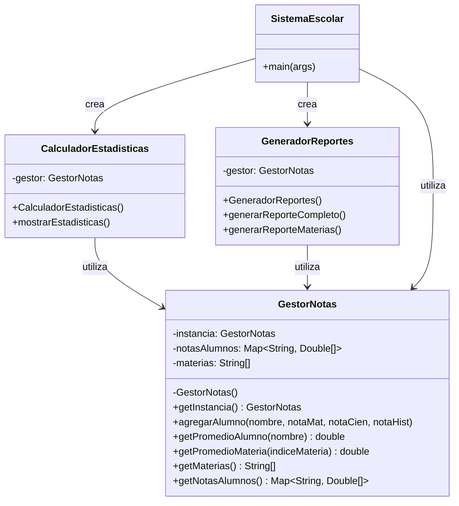

# 📚 Sistema Escolar - Gestión de Notas

Este proyecto es un sistema de gestión de notas escolares implementado en Java que utiliza el patrón de diseño Singleton para garantizar una única instancia del gestor de notas en toda la aplicación.

## 🎯 Características

- **Gestión centralizada de notas** mediante el patrón Singleton
- **Cálculo de promedios** por alumno y por materia
- **Generación de reportes** completos y específicos
- **Estadísticas detalladas** del rendimiento académico
- **Arquitectura modular** y escalable

## 🏗️ Diagrama UML del Sistema



## 📦 Estructura del Proyecto

```bash
SistemaEscolar/
├── GestorNotas.java          # Clase Singleton para gestión centralizada
├── CalculadorEstadisticas.java # Cálculo de estadísticas académicas
├── GeneradorReportes.java    # Generación de reportes detallados
├── SistemaEscolar.java       # Clase principal con método main
└── README.md                 # Documentación del proyecto
```

## 🚀 Cómo Ejecutar

1. **Compilar todos los archivos Java:**

   ```bash
   javac *.java
   ```

2. **Ejecutar la aplicación:**

   ```bash
   java SistemaEscolar
   ```

## 📊 Funcionalidades

### Gestión de Alumnos

- Registro de alumnos con notas en tres materias: Matemáticas, Ciencias e Historia
- Almacenamiento centralizado de datos académicos

### Cálculo de Promedios

- Promedio individual por alumno
- Promedio grupal por materia
- Estadísticas generales del curso

### Generación de Reportes

- Reporte completo con todas las notas y promedios
- Reporte específico por materias
- Visualización clara y formateada de los datos

## 🛠️ Tecnologías Utilizadas

- **Java SE** - Lenguaje de programación
- **Patrón Singleton** - Para gestión única de instancia
- **Collections Framework** - Para manejo eficiente de datos

## 📝 Notas de Implementación

El sistema utiliza el patrón Singleton en la clase `GestorNotas` para asegurar que:

- Solo exista una instancia del gestor de notas
- Todos los componentes accedan a los mismos datos
- La consistencia de la información se mantenga en toda la aplicación

## 🔄 Flujo de Datos

1. `SistemaEscolar` inicializa el `GestorNotas`
2. Se agregan alumnos con sus notas
3. `GeneradorReportes` crea reportes usando los datos del gestor
4. `CalculadorEstadisticas` calcula métricas académicas
5. Todos los componentes acceden a la misma instancia del gestor

## 📈 Ejemplo de Salida

```bash
👨‍🎓 Alumno Ana García registrado
👨‍🎓 Alumno Carlos López registrado

📊 === REPORTE COMPLETO ===

Alumno: Ana García
Matemáticas: 8.5
Ciencias: 9.0
Historia: 7.5
Promedio: 8.33

📈 === ESTADÍSTICAS ===
Total alumnos: 4
Promedio Matemáticas: 7.88
Promedio Ciencias: 8.38
Promedio Historia: 7.50
```

Este proyecto demuestra una implementación práctica del patrón Singleton en un sistema de gestión académica, mostrando cómo mantener la consistencia de datos a través de múltiples componentes.
